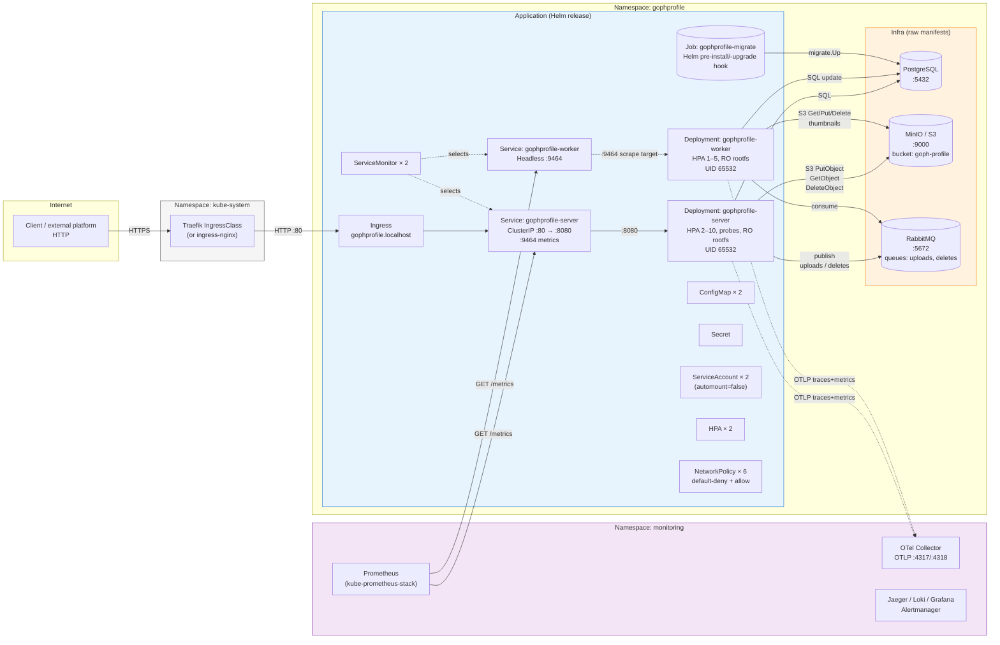
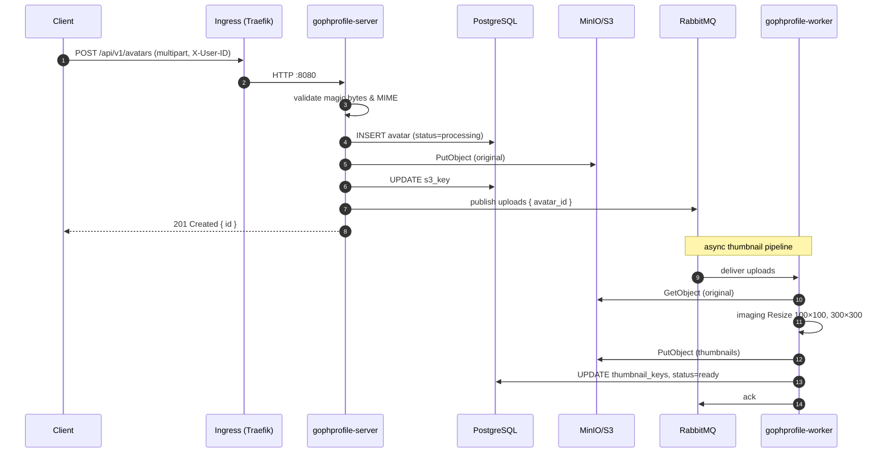
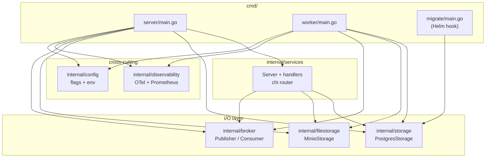

# GophProfile — Architecture

A high-level view of the runtime, with Kubernetes components called out explicitly. Diagrams are [Mermaid](https://mermaid.js.org/)

## System overview (Kubernetes)

### Legend

- **Solid arrows** — synchronous request/response (HTTP, SQL, S3, AMQP).
- **Dashed arrows** — out-of-band telemetry / scraping / selectors.
- **Cylinder shapes** — stateful components (DB, queue, object store).
- **Blue cluster** — packaged by the Helm chart at `deploy/helm/gophprofile/`.
- **Orange cluster** — local-only infra (raw manifests under `deploy/k8s/infra/`).
  Replace with a managed Postgres / S3 / RabbitMQ in production.
- **Purple cluster** — observability stack, lives in its own namespace.

## Avatar upload — sequence

## Layering (code-level)

`cmd/*/main.go` are composition roots — they own concrete implementations and
wire them through the interface boundaries (`storage.Storage`,
`filestorage.FileStorage`, broker `Publisher`/`Consumer`). All three commands
share the same `internal/storage` package, which is why the Helm migration
hook can call `storage.ApplyMigrationsDSN` directly.

## Key flows

| Flow | Path |
|---|---|
| Health check | Client → Traefik → Ingress → Server `/health` → Postgres ping |
| Upload | Client → Server → DB (insert) → MinIO (put) → DB (update key) → RabbitMQ (publish) |
| Thumbnail | RabbitMQ → Worker → MinIO (get/put thumbs) → DB (update keys + status=ready) |
| Delete | Client → Server → DB (soft-delete) → RabbitMQ (publish deletes) → Worker → MinIO (drop original + thumbs) |
| Metrics scrape | Prometheus → Service `:9464/metrics` (server + worker) |
| Traces / metrics push | Server / Worker → OTel Collector :4317 (OTLP gRPC) |
| Migration | `helm install/upgrade` → migrate Job (`cmd/migrate`) → Postgres |

## Security boundaries

- **Pod-level:** non-root (UID 65532), read-only rootfs, drop ALL caps,
  seccomp `RuntimeDefault`, no SA token projected.
- **Network-level:** default-deny in `gophprofile`, then targeted allow rules
  (DNS → kube-system, HTTP-in from ingress controller, metrics-in from monitoring,
  egress to in-ns Postgres/MinIO/RabbitMQ, OTLP egress to monitoring).
- **Cluster-level:** dedicated `ServiceAccount` per workload, no `Role`/`RoleBinding`
  granted (least privilege = no API access).
